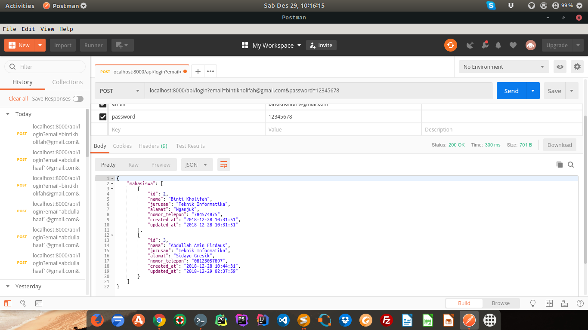

<h1>CRUD dengan API Laravel</h1>

implementasi crud dengan laravel, dan penyediaan API autentikasi dengan menggunakan <b>Laravel Passport</b>

 

Untuk testing API menggunakan postman, contoh skema testing dengan API login, jika berhasil akan menampilkan data mahasiswa dalam bentuk json seperti dibawah ini: 
 

#INFORMATION
<ul>
	<li>Laravel versi 5.7</li>
	<li>Passport versi 7.0</li>
</ul>

#Attention
- setelah clone project, jalankan composer install
- kemudian jalankan php artisan migrate